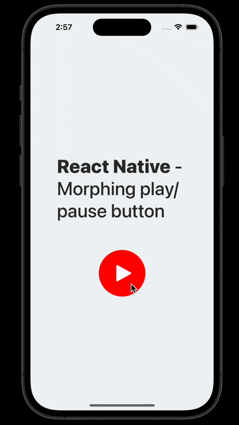

# React Native Morphing Play/Pause Button



The is the code for the tutorial in the article [How to create React Native SVG morphing animations](https://mikael-ainalem.medium.com/how-to-create-react-native-svg-morphing-animations-2fea07bf2d6f)

# How to install and run it

```bash
# iOS
yarn && npx pod-install && yarn ios

# or Android
yarn && yarn android
```
